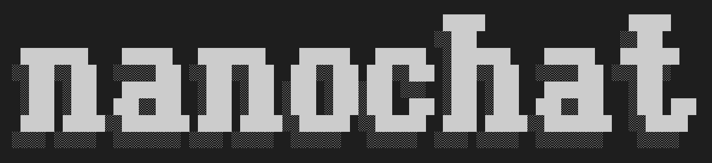

# nanochat



> The best ChatGPT that $100 can buy.

This repo is a full-stack implementation of an LLM like ChatGPT in a single, clean, minimal, hackable, dependency-lite codebase. nanochat is designed to run on a single 8XH100 node via scripts like [speedrun.sh](speedrun.sh), that run the entire pipeline start to end. This includes tokenization, pretraining, finetuning, evaluation, inference, and web serving over a simple UI so that you can talk to your own LLM just like ChatGPT. nanochat will become the capstone project of the course LLM101n being developed by Eureka Labs.

## Quick start

The fastest way to feel the magic is to run the speedrun script [speedrun.sh](speedrun.sh), which trains and inferences the $100 tier of nanochat. On an 8XH100 node at $24/hr, this gives a total run time of about 4 hours. Boot up a new 8XH100 GPU box from your favorite provider (e.g. I use and like [Lambda](https://lambda.ai/service/gpu-cloud)), and kick off the training script:

```bash
bash speedrun.sh
```

Alternatively, since the script runs for 4 hours, I like to launch it like this inside a new screen session `speedrun` (and also log output to `speedrun.log`):

```bash
screen -L -Logfile speedrun.log -S speedrun bash speedrun.sh
```

See the [screen cheatsheet](https://gist.github.com/jctosta/af918e1618682638aa82) if you are less familiar. You can watch it go inside the screen session, or detach with `Ctrl-a d` and `tail speedrun.log` to view progress. Now wait 4 hours. Once it's done, you can talk to your LLM via the ChatGPT-like web UI. Make sure again that your local uv virtual environment is active (run `source .venv/bin/activate`), and serve it:

```bash
python -m scripts.chat_web
```

And then visit the URL shown. Make sure to access it correctly, e.g. on Lambda use the public IP of the node you're on, followed by the port, so for example [http://209.20.xxx.xxx:8000/](http://209.20.xxx.xxx:8000/), etc. Then talk to your LLM as you'd normally talk to ChatGPT! Get it to write stories or poems. Ask it to tell you who you are to see a hallucination. Ask it why the sky is blue. Or why it's green. The speedrun is a 4e19 FLOPs capability model so it's a bit like talking to a kindergartener :).

---


---

You can also `cat report.md` file which appeared in the project directory and contains the "report card" of the run, i.e. a bunch of evaluations and metrics. At the very end, you'll see a summary table, for example:

---

- Characters: 333,989
- Lines: 8,304
- Files: 44
- Tokens (approx): 83,497
- Dependencies (uv.lock lines): 2,004

| Metric          | BASE     | MID      | SFT      | RL       |
|-----------------|----------|----------|----------|----------|
| CORE            | 0.2219   | -        | -        | -        |
| ARC-Challenge   | -        | 0.2875   | 0.2807   | -        |
| ARC-Easy        | -        | 0.3561   | 0.3876   | -        |
| GSM8K           | -        | 0.0250   | 0.0455   | 0.0758   |
| HumanEval       | -        | 0.0671   | 0.0854   | -        |
| MMLU            | -        | 0.3111   | 0.3151   | -        |
| ChatCORE        | -        | 0.0730   | 0.0884   | -        |

Total wall clock time: 3h51m

---

(Your table might be missing the RL number by default). For a lot more information around the speedrun script and what to look for and expect, please refer to the walkthrough that I posted in Discussions of the repo: ["Introducing nanochat: The best ChatGPT that $100 can buy"](https://github.com/karpathy/nanochat/discussions/1).

## Bigger models

Unsurprisingly, $100 is not enough to train a highly performant ChatGPT clone. In fact, LLMs are famous for their multi-million dollar capex. For our purposes, I think there are two more scales of interest. First is the ~$300 tier d26 model (i.e. depth=26) that trains in ~12 hours, which slightly outperforms GPT-2 CORE score. Second is the $1000 tier (~41.6 hours), just because it's a nice round number. But both of these are not yet fully supported and therefore not attached here in the master branch yet.

That said, to give a sense, the example changes needed for the [speedrun.sh](speedrun.sh) file to train a GPT-2 grade model d26 only involve three changes:

```bash
...
# you'll need to download more data shards for pretraining
# get the number of parameters, multiply 20 to get tokens, multiply by 4.8 to get chars,
# divide by 250 million to get number of shards. todo need to improve this...
python -m nanochat.dataset -n 450 &
...
# use --depth to increase model size. to not oom, halve device batch size 32 -> 16:
torchrun --standalone --nproc_per_node=8 -m scripts.base_train -- --depth=26 --device_batch_size=16
...
# make sure to use the same later during midtraining:
torchrun --standalone --nproc_per_node=8 -m scripts.mid_train -- --device_batch_size=16
```

That's it! The biggest thing to pay attention to is making sure you have enough data shards to train on (the code will loop and do more epochs over the same training set otherwise, decreasing learning speed a bit), and managing your memory/VRAM, primarily by decreasing the `device_batch_size` until things fit (the scripts automatically compensates by increasing the number of gradient accumulation loops, simply turning parallel compute to sequential compute).

## Computing Environments

nanochat is designed to be flexible and can run on a variety of hardware backends, including NVIDIA GPUs (via CUDA) and AMD GPUs (via ROCm). The code is written to be device-agnostic and will automatically detect and use the available hardware.

### Prerequisites

Before you begin, ensure you have the necessary drivers and toolkits installed for your hardware:

-   **NVIDIA GPUs:** You will need the NVIDIA driver and the CUDA Toolkit installed.
-   **AMD GPUs:** You will need to install the ROCm platform.

    **Note for newer AMD GPUs:** Some newer AMD GPU architectures (e.g., `gfx1151`) may not be officially supported by the pre-compiled PyTorch ROCm builds yet. If you encounter a `torch.AcceleratorError: HIP error: invalid device function` error, you can work around this by setting the `HSA_OVERRIDE_GFX_VERSION` environment variable to a compatible, supported architecture. For example, for `gfx1151`, you can use `11.0.0`. The `speedrun.sh` script includes this workaround by default.

### Python Dependencies

The Python dependencies are managed by `uv`. The project is configured to install a specific version of PyTorch that is compatible with your hardware.

**Important:** Before installing the dependencies, you must configure `pyproject.toml` to use the correct PyTorch build for your system.

-   **For ROCm:**
    Open `pyproject.toml` and ensure the `tool.uv.index` section points to the ROCm wheels. For example:
    ```toml
    [[tool.uv.index]]
    name = "pytorch-rocm63"
    url = "https://download.pytorch.org/whl/rocm6.3"
    explicit = true
    ```
-   **For CUDA:**
    You will need to change the `url` to the appropriate CUDA version. For example, for CUDA 12.8:
    ```toml
    [[tool.uv.index]]
    name = "pytorch-cu128"
    url = "https://download.pytorch.org/whl/cu128"
    explicit = true
    ```
    You can find the correct URL for your CUDA version on the [PyTorch website](https://pytorch.org/get-started/locally/).

Once you have configured `pyproject.toml`, you can install the dependencies by running `uv sync` from within the activated virtual environment, as shown in the `speedrun.sh` script.

### Running on a Single GPU

The `speedrun.sh` script has been configured to run on a single GPU by default, using `python -m ...` instead of `torchrun`. If you have a multi-GPU setup, you can modify the script to use `torchrun` with the appropriate `--nproc_per_node` setting.

### Memory Considerations

If your GPU has less than 80GB of VRAM, you may need to reduce the `device_batch_size` in the training scripts to avoid running out of memory. This will increase training time but will allow the model to train successfully on lower-VRAM cards.

## Questions

nanochat is designed to be short and sweet. One big advantage of this is that we can package up all of the files together and copy paste them to your favorite LLM to ask arbitrary questions. As an example, I like to package up the repo using the [files-to-prompt](https://github.com/simonw/files-to-prompt) utility like so:

```bash
files-to-prompt . -e py -e md -e rs -e html -e toml -e sh --ignore "*target*" --cxml > packaged.txt
```

This includes all py, rs, html, toml, sh files, excludes the `rustbpe/target` folder, and chooses the cxml output format. Everything is written to the `packaged.txt` file, which atm measures ~330KB (i.e. well below ~100K tokens for a state of the art LLM), and ~8K lines of code in 45 files.

Alternatively, I recommend using [DeepWiki](https://deepwiki.com/) from Devin/Cognition to ask questions of this repo. In the URL of this repo, simply change github.com to deepwiki.com, and you're off.

## Tests

I haven't invested too much here but some tests exist, especially for the tokenizer. Run e.g. as:

```bash
python -m pytest tests/test_rustbpe.py -v -s
```

## Contributing

nanochat is nowhere finished. The goal is to improve the state of the art in micro models that are accessible to work with end to end on budgets of < $1000 dollars. Accessibility is about overall cost but also about cognitive complexity - nanochat is not an exhaustively configurable LLM "framework"; there will be no giant configuration objects, model factories, or if-then-else monsters in the code base. It is a single, cohesive, minimal, readable, hackable, maximally-forkable "strong baseline" codebase designed to run start to end and produce a concrete ChatGPT clone and its report card.

## Acknowledgements

- The name (nanochat) derives from my earlier project [nanoGPT](https://github.com/karpathy/nanoGPT), which only covered pretraining.
- nanochat is also inspired by [modded-nanoGPT](https://github.com/KellerJordan/modded-nanogpt), which gamified the nanoGPT repo with clear metrics and a leaderboard, and borrows a lot of its ideas and some implementation for pretraining.
- Thank you to [HuggingFace](https://huggingface.co/) for fineweb and smoltalk.
- Thank you [Lambda](https://lambda.ai/service/gpu-cloud) for the compute used in developing this project.
- Thank you to chief LLM whisperer 🧙‍♂️ Alec Radford for advice/guidance.

## Cite

If you find nanochat helpful in your research cite simply as:

```bibtex
@misc{nanochat,
  author = {Andrej Karpathy},
  title = {nanochat: The best ChatGPT that $100 can buy},
  year = {2025},
  publisher = {GitHub},
  url = {https://github.com/karpathy/nanochat}
}
```

## License

MIT
